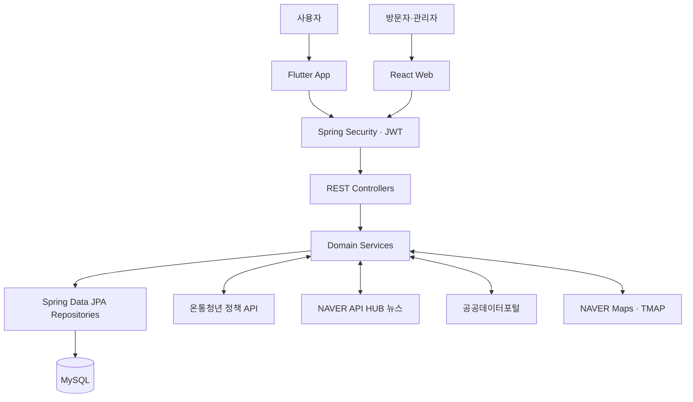

<div align="center">
  

  <h1>생존일기</h1>

  <p><strong>청년을 위한 지출 관리·생활비 절약 정보 서비스</strong></p>
  <p>
    오늘의 지출을 기록하고 소비 흐름을 확인하며,<br />
    맞춤 정책·뉴스와 우리 동네 절약 정보를 한곳에서 만나는 서비스입니다.
  </p>
</div>

<div align="center">


</div>

## 서비스 소개

> "이번 달에 얼마를 더 쓸 수 있을까?"
>
> "내 조건에 맞는 청년 정책과 주변 절약 정보를 한 번에 찾을 수 없을까?"

생활비를 관리하려면 지출 내역, 정책 사이트, 뉴스, 지도와 커뮤니티를 각각 확인해야 합니다. 생존일기는 흩어진 정보를 하나의 흐름으로 연결해 청년이 자신의 소비를 이해하고 필요한 혜택을 더 쉽게 찾도록 돕기 위해 시작한 프로젝트입니다.

Flutter 앱에서 지출 관리부터 정책·뉴스·지도·커뮤니티 기능을 제공하고, React 웹에서 서비스 소개와 관리자 운영 화면을 제공합니다. 두 클라이언트는 하나의 Spring Boot REST API를 사용하며 사용자 데이터와 공공데이터 API 키는 서버에서 관리합니다.

### 핵심 가치

- **기록 중심 관리**: 날짜별 지출과 예산을 기록하고 일간·월간 소비 흐름을 확인합니다.
- **개인화된 정보**: 사용자 조건과 관심사를 바탕으로 정책과 생활경제 뉴스를 정리합니다.
- **지역 생활 정보**: 착한가격업소, 공공시설, 공영주차장과 주거 정보를 지도에서 탐색합니다.
- **함께 만드는 절약 습관**: 사용자들이 경험과 질문을 나누고 절약 성과를 배지로 확인합니다.
- **일관된 데이터 흐름**: Flutter 앱과 React 웹이 동일한 REST API와 데이터 기준을 사용합니다.

## 주요 기능

| 기능           | 설명                                                                                           |
| -------------- | ---------------------------------------------------------------------------------------------- |
| 홈             | 오늘의 사용 가능 금액, 최근 지출, 정책 브리핑, 맞춤 뉴스와 절약 배지를 한 화면에서 확인합니다. |
| 가계부         | 일간·월간 예산과 지출을 기록하고 카테고리별 통계와 이전 기간 비교를 제공합니다.                |
| 결제 알림 감지 | Android 결제 알림에서 지출 후보를 감지하고 사용자가 확인·수정한 뒤 저장합니다.                 |
| 맞춤 정책      | 나이, 지역, 취업·소득·교육 상태와 관심사를 바탕으로 온통청년 정책을 추천합니다.                |
| 맞춤 뉴스      | 청년 생활비와 절약 관련 뉴스를 수집하고 사용자 관심사와 최신성을 기준으로 정렬합니다.          |
| 절약 지도      | 착한가격업소, 공공시설, 공영주차장과 주거지 임대차 실거래 정보를 지도와 목록으로 제공합니다.   |
| 커뮤니티       | 게시글·댓글 작성, 좋아요, 북마크, 검색, 내 활동과 FAQ 기능을 제공합니다.                       |
| 회원·프로필    | 이메일 및 카카오·네이버 로그인, 프로필과 관심 정보 수정, 프로필 이미지 관리를 지원합니다.      |
| 관리자         | 웹에서 회원·지출 내역을 확인하고 커뮤니티 게시글과 사용자 문의를 관리합니다.                   |

## 서비스 이용 흐름


## 맞춤 정보 제공 기준

### 정책 추천

온통청년 정책을 사용자의 나이, 시·도와 시·군·구, 취업 상태, 소득 구간, 재직·구직 상태, 학력·재학 상태와 관심 분야에 맞춰 필터링하고 우선순위를 계산합니다. 사용자가 숨긴 정책은 추천에서 제외하고, 특정 분야에 결과가 몰리지 않도록 상위 결과의 카테고리를 분산합니다.

### 뉴스 추천

NAVER API HUB 뉴스 검색 결과에서 청년 생활과 절약 주제에 맞는 기사를 선별한 뒤 사용자 관심 분야 일치도와 기사 최신성을 점수화해 정렬합니다. 추천 이유도 함께 반환해 어떤 관심 정보가 반영됐는지 확인할 수 있습니다.

> 현재 정책과 뉴스 추천은 머신러닝 학습 모델이 아닌 조건 필터와 규칙 기반 점수 방식입니다.

## 기술 스택

| 구분         | 기술                                                                   |
| ------------ | ---------------------------------------------------------------------- |
| App          | Dart, Flutter, Material, flutter_naver_map, Geolocator                 |
| Web          | React 19, TypeScript 7, Vite 8, Wouter, Lucide React                   |
| Backend      | Java 17, Spring Boot 4.1, Spring MVC                                   |
| Security     | Spring Security, JWT Access·Refresh Token, Kakao·Naver OAuth           |
| Data         | Spring Data JPA, MySQL, Flyway                                         |
| External API | 온통청년, NAVER API HUB 뉴스, 공공데이터포털, 국토교통부 임대차 실거래 |
| Map          | NAVER Maps Geocoding, NAVER Map SDK, TMAP Directions                   |
| Build·Test   | Gradle, JUnit, Flutter Test, npm                                       |

## 아키텍처



Flutter 앱과 React 웹의 요청은 Spring Security를 거쳐 Controller-Service-Repository 계층에서 처리합니다. 지출, 예산, 회원, 관심 정보와 커뮤니티 데이터는 MySQL에 저장하고, 정책·뉴스·지도 정보는 백엔드가 외부 API와 통신해 가공한 뒤 클라이언트에 전달합니다.

## 저장소 구성

| 저장소                                                                            | 역할                                                    |
| --------------------------------------------------------------------------------- | ------------------------------------------------------- |
| [SurvivalDiary_App](https://github.com/limeorangenamu/SurvivalDiary_App)          | Flutter 기반 Android·Web 사용자 앱                      |
| [SurvivalDiary_WebFrontend](https://github.com/KwanEon/SurvivalDiary_WebFrontend) | React 기반 서비스 소개 페이지와 관리자 화면             |
| [SurvivalDiary_Backend](https://github.com/support9938/SurvivalDiary_Backend)     | Spring Boot REST API, 인증, 데이터 저장과 외부 API 연동 |

## 프로젝트 구조

```text
SurvivalDiary/
├── SurvivalDiary_App/
│   └── lib/
│       ├── core/          설정, 라우팅, API 서비스와 공통 테마
│       ├── features/      인증, 홈, 가계부, 정책, 지도, 커뮤니티, 프로필
│       └── shared/        공통 위젯
├── SurvivalDiary_WebFrontend/
│   ├── public/            브랜드와 앱 화면 이미지
│   └── src/
│       ├── app/           웹 라우팅
│       ├── features/      서비스 소개와 관리자 기능
│       └── shared/        디자인 토큰과 전역 스타일
└── SurvivalDiary_WebBackend/
    └── src/main/
        ├── java/com/survivaldiary/
        │   ├── domain/    기능별 Controller, Service, Repository, DTO
        │   └── global/    보안, 예외 처리와 공통 설정
        └── resources/
            └── db/migration/  Flyway 데이터베이스 마이그레이션
```

백엔드는 <code>admin</code>, <code>budget</code>, <code>community</code>, <code>expense</code>, <code>home</code>, <code>map</code>, <code>news</code>, <code>policy</code>, <code>savingbadge</code>, <code>user</code> 도메인으로 나뉩니다. 앱과 웹도 기능 단위 폴더를 사용해 각 화면, API 모듈, 타입과 스타일의 책임을 분리합니다.

## 시작하기

### 1. 준비 사항

- JDK 17
- MySQL
- Node.js <code>20.19 이상</code> 또는 <code>22.12 이상</code>
- npm
- Flutter SDK와 Dart <code>3.6 이상</code>
- 사용할 외부 서비스의 API 키

Gradle은 백엔드 저장소에 Wrapper가 포함되어 있어 별도로 설치하지 않아도 됩니다.

### 2. 저장소 복제

세 저장소를 같은 상위 폴더에 복제합니다.

```bash
git clone https://github.com/limeorangenamu/SurvivalDiary_App.git
git clone https://github.com/KwanEon/SurvivalDiary_WebFrontend.git
git clone https://github.com/support9938/SurvivalDiary_Backend.git SurvivalDiary_WebBackend
```

### 3. 데이터베이스 생성

```sql
CREATE DATABASE survival_diary
  CHARACTER SET utf8mb4
  COLLATE utf8mb4_unicode_ci;
```

Flyway가 백엔드 시작 시 테이블과 초기 데이터를 자동으로 생성·마이그레이션합니다.

### 4. 백엔드 설정

예시 설정 파일을 복사합니다.

Windows PowerShell:

```powershell
cd SurvivalDiary_WebBackend
Copy-Item src/main/resources/application-secret.yml.example src/main/resources/application-secret.yml
```

macOS 또는 Linux:

```bash
cd SurvivalDiary_WebBackend
cp src/main/resources/application-secret.yml.example src/main/resources/application-secret.yml
```

생성한 <code>application-secret.yml</code>에 데이터베이스 연결 정보, JWT 비밀 키와 사용할 외부 API 키를 입력합니다.

| 구분           | 주요 환경 변수                                                                                                    |
| -------------- | ----------------------------------------------------------------------------------------------------------------- |
| Database       | <code>DB_URL</code>, <code>DB_USERNAME</code>, <code>DB_PASSWORD</code>                                           |
| Authentication | <code>JWT_SECRET</code>, <code>KAKAO_REST_API_KEY</code>, <code>NAVER_CLIENT_ID</code>                            |
| Policy·News    | <code>YOUTH_POLICY_API_KEY</code>, <code>NAVER_API_HUB_CLIENT_ID</code>, <code>NAVER_API_HUB_CLIENT_SECRET</code> |
| Public Data    | <code>GOOD_PRICE_API_KEY</code>, <code>PUBLIC_DATA_API_KEY</code>, <code>REAL_ESTATE_RENT_API_KEY</code>          |
| Map            | <code>NAVER_MAP_API_KEY_ID</code>, <code>NAVER_MAP_API_KEY</code>, <code>TMAP_APP_KEY</code>                      |

비밀번호와 실제 API 키가 들어 있는 <code>application-secret.yml</code>은 Git에 커밋하지 마세요.

### 5. 백엔드 실행

Windows:

```powershell
cd SurvivalDiary_WebBackend
.\gradlew.bat bootRun
```

macOS 또는 Linux:

```bash
cd SurvivalDiary_WebBackend
./gradlew bootRun
```

백엔드는 기본적으로 <code>http://localhost:8080</code>에서 실행되며 Swagger UI는 <code>http://localhost:8080/swagger-ui/index.html</code>에서 확인할 수 있습니다.

### 6. 웹 실행

```bash
cd SurvivalDiary_WebFrontend
npm ci
npm run dev
```

웹 개발 서버는 <code>http://localhost:5173</code>에서 실행됩니다. <code>/api</code>와 <code>/community-images</code> 요청은 <code>http://localhost:8080</code>의 백엔드로 전달됩니다.

필요하면 <code>.env.example</code>을 <code>.env.local</code>로 복사해 API 주소와 지도 클라이언트 ID를 설정합니다.

```properties
VITE_API_BASE_URL=http://localhost:8080/api
VITE_NAVER_MAP_CLIENT_ID=your-naver-map-client-id
```

### 7. Flutter 앱 실행

```bash
cd SurvivalDiary_App
flutter pub get
flutter run --dart-define=API_BASE_URL=http://localhost:8080
```

Android 에뮬레이터나 실기기에서는 실행 환경에서 접근 가능한 백엔드 주소를 <code>API_BASE_URL</code>에 지정합니다. 카카오·네이버 로그인을 사용할 때는 각 플랫폼 키도 빌드 설정 또는 <code>--dart-define</code>으로 주입합니다.

## 주요 화면

### Flutter 앱

| 영역     | 주요 화면                                                 |
| -------- | --------------------------------------------------------- |
| 인증     | 온보딩, 이메일·소셜 로그인, 회원가입                      |
| 홈       | 오늘의 예산, 최근 지출, 일일 요약, 정책 브리핑, 맞춤 뉴스 |
| 가계부   | 지출 등록, 감지된 결제 내역, 지출 통계, 예산 설정         |
| 정책     | 맞춤 조건 설정, 추천 목록, 상세, 숨긴 정책                |
| 지도     | 착한가격업소, 공공시설, 공영주차장, 주거지 임대차 실거래  |
| 커뮤니티 | 게시글 목록·검색·상세·작성, 댓글, 좋아요와 북마크         |
| 프로필   | 회원정보 수정, 프로필 이미지, 내가 쓴 글과 저장한 글      |

### React 웹

| 경로                | 설명                                        |
| ------------------- | ------------------------------------------- |
| <code>/</code>      | 서비스 소개, 기능 미리보기, 이용 방법과 FAQ |
| <code>/admin</code> | 관리자 로그인과 회원·게시글·문의 관리       |

## 주요 REST API

| 구분           | 엔드포인트                        |
| -------------- | --------------------------------- |
| 인증           | <code>/api/auth</code>            |
| 회원·프로필    | <code>/api/users</code>           |
| 홈 요약        | <code>/api/home</code>            |
| 예산           | <code>/api/budgets</code>         |
| 지출           | <code>/api/expenses</code>        |
| 정책 추천·검색 | <code>/api/policies</code>        |
| 맞춤 뉴스      | <code>/api/news</code>            |
| 절약 지도      | <code>/api/map</code>             |
| 커뮤니티       | <code>/api/community/posts</code> |
| 관리자         | <code>/api/admin</code>           |

날짜는 ISO 8601 형식을 사용하고 금액은 정수 원 단위로 주고받습니다. Flutter 앱과 React 웹은 데이터베이스나 공공데이터 API에 직접 접근하지 않고 REST API를 통해 데이터를 요청합니다.

## 외부 데이터 연동

| 데이터               | 제공·연동 서비스        |
| -------------------- | ----------------------- |
| 청년 정책            | 온통청년                |
| 생활경제 뉴스        | NAVER API HUB 뉴스 검색 |
| 착한가격업소         | 공공데이터포털 ODcloud  |
| 공공시설·공영주차장  | 공공데이터포털          |
| 주거지 임대차 실거래 | 국토교통부 공공데이터   |
| 주소 검색·좌표 변환  | NAVER Maps Geocoding    |
| 지도 표시            | NAVER Map SDK           |
| 길찾기               | TMAP Directions         |
| 소셜 로그인          | Kakao, NAVER            |

외부 API 장애나 미설정 상태를 고려해 타임아웃, 캐시와 오류 응답을 백엔드에서 관리합니다.

## 검증

백엔드 테스트:

```powershell
cd SurvivalDiary_WebBackend
.\gradlew.bat test
```

웹 포맷·타입 검사와 프로덕션 빌드:

```bash
cd SurvivalDiary_WebFrontend
npm run format:check
npm run typecheck
npm run build
```

Flutter 정적 분석과 테스트:

```bash
cd SurvivalDiary_App
flutter analyze
flutter test
```

<div align="center">
  <strong>오늘의 기록이 내일의 여유가 되도록, 생존일기와 함께하세요.</strong>
</div>
